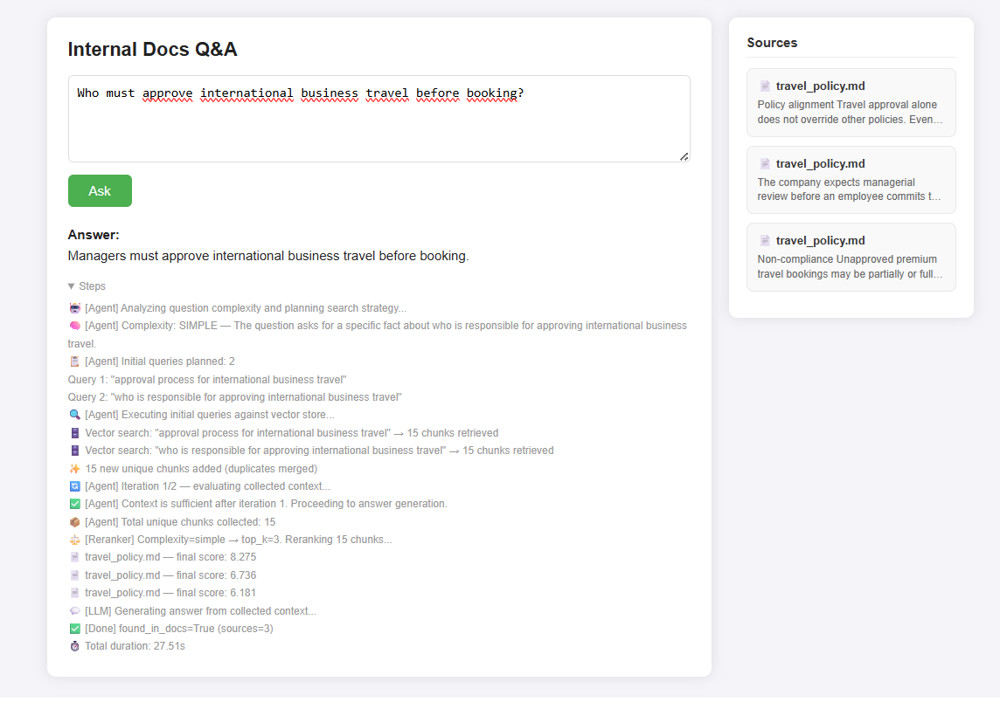
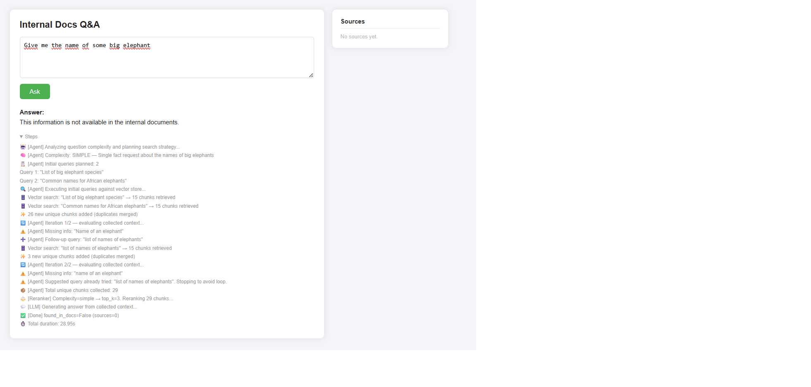

# AdpRag — Agentic RAG System for Internal Documents

An AI-powered question answering system that retrieves answers **exclusively** from internal company documents (policies, procedures, guidelines). Built with an agentic retrieval loop, semantic chunking, cross-encoder reranking, and LLM-based quality filtering.

---

## What It Does

Send a natural language question to the API. The system:

1. **Plans** how many searches are needed based on question complexity
2. **Searches** the vector database iteratively until it has enough context
3. **Reranks** retrieved chunks by combining semantic relevance with document quality
4. **Generates** a grounded answer using only the retrieved documents
5. **Cites** which documents were used and returns a full step-by-step trace

If the answer is not in the documents, the system explicitly says so — it does not hallucinate.

---
## Results



---

## Architecture Overview

```
User Question
      │
      ▼
┌─────────────────────────────────────────────┐
│               RAGAgent                      │
│                                             │
│  1. Planning                                │
│     LLM decides: simple or complex?         │
│     Generates 1–3 targeted search queries   │
│                                             │
│  2. Iterative Retrieval Loop (max 3 rounds) │
│     → Vector search (ChromaDB)              │
│     → Deduplicate chunks across queries     │
│     → LLM evaluates: enough context?        │
│     → If not: generate new query, repeat    │
└─────────────────────────────────────────────┘
      │
      ▼
┌─────────────────────────────────────────────┐
│               RAGReranker                   │
│                                             │
│  CrossEncoder score  (semantic relevance)   │
│       × 0.7                                 │
│  + Quality score     (from ingestion)       │
│       × 0.3                                 │
│                                             │
│  → Keep top-K (3 for simple, 8 for complex) │
└─────────────────────────────────────────────┘
      │
      ▼
┌─────────────────────────────────────────────┐
│               SimpleQAChain                 │
│                                             │
│  Mistral (via Ollama) generates answer      │
│  strictly from retrieved context            │
└─────────────────────────────────────────────┘
      │
      ▼
 Answer + Sources + Steps trace
```

---

## Ingestion Pipeline

Before the API can answer questions, documents must be ingested:

```
documents/*.md
      │
      ▼
  DirectoryLoader
  (UnstructuredMarkdownLoader)
      │
      ▼
  SemanticChunker
  Splits documents at semantic boundaries
  rather than fixed character counts.
  Controlled by CHUNKING_THRESHOLD (percentile).
      │
      ▼
  LLM Quality Scoring  ← runs in parallel (ThreadPoolExecutor)
  Each chunk is scored on:
    • content_score  — is the text meaningful, readable language?
    • doc_score      — is the filename trustworthy? (WIP/draft = low)
    • quality_score  = (content_score × 0.7) + (doc_score × 0.3)
  Scores are stored in chunk metadata.
      │
      ▼
  Quality Filter
  Chunks below QUALITY_DROP_THRESHOLD are dropped entirely.
  Garbage documents never enter the vector store.
      │
      ▼
  ChromaDB
  Embeddings: sentence-transformers/all-MiniLM-L6-v2
```

**Key design decision:** Quality scoring happens at ingestion time, not at query time. This means zero extra LLM calls per user request — scores are pre-computed and stored in metadata.

---

## Agentic Retrieval — How It Works

The core innovation over a basic RAG pipeline is the **planning + iterative retrieval loop**.

### Phase 1 — Planning
The LLM analyzes the question and returns a structured plan:
```json
{
  "complexity": "complex",
  "reasoning": "Requires information from multiple policy areas",
  "queries": [
    "expense claim submission deadline",
    "expense reimbursement policy rules"
  ]
}
```
Simple questions get 1 query. Complex questions (checklists, summaries, multi-step) get 2–3.

### Phase 2 — Iterative Retrieval
After each round of searches, the LLM evaluates the collected context:
```json
{
  "enough": false,
  "missing": "approval process for amounts over 500 EUR",
  "next_query": "expense approval manager threshold"
}
```
If context is insufficient, a new targeted query is generated and the loop continues (max 3 iterations). The system tracks all tried queries and explicitly prevents repeating them.

### Why This Matters
A single vector search often misses relevant chunks because user questions use different vocabulary than the documents. The iterative loop lets the system **self-correct** and find information it initially missed.

---

## Reranking

Retrieved chunks are reranked using two signals:

| Signal | Source | Weight |
|---|---|---|
| CrossEncoder score | `cross-encoder/ms-marco-MiniLM-L-6-v2` — measures how well the chunk answers the query | 70% |
| Quality score | Pre-computed at ingestion, stored in chunk metadata | 30% |

Both scores are normalized to [0, 1] before combining so neither dominates by scale.

**Dynamic top-K:** Simple questions keep the top 3 chunks. Complex questions keep the top 8. This prevents irrelevant chunks from diluting the context for straightforward questions.

---

## Garbage Document Handling

The system handles nonsense or low-quality documents at two levels:

1. **Ingestion time** — LLM assigns a near-zero `content_score` to gibberish. Combined `quality_score` falls below the drop threshold and the chunk is never stored.

2. **Query time** — Even if a low-quality chunk enters the store, its `quality_score` penalizes its reranker ranking, pushing it out of top-K.

If a user asks about a nonsense document (*"Summarize the Krzth Monolithic Reference"*), the system correctly responds that the information is not available — it does not hallucinate an interpretation of gibberish.

---

## API

### `POST /ask`
```json
{
  "question": "What is the deadline for submitting expense claims?",
  "top_k": null
}
```

Response:
```json
{
  "question": "What is the deadline for submitting expense claims?",
  "answer": "Expense claims must be submitted within 30 days...",
  "found_in_docs": true,
  "sources": [
    {
      "document": "expense_policy.md",
      "chunk_preview": "All expense claims must be submitted within 30 days of...",
      "relevance_score": 0.921
    }
  ],
  "steps": [
    "🤖 [Agent] Analyzing question complexity...",
    "🧠 [Agent] Complexity: SIMPLE — single specific fact",
    "📋 [Agent] Initial queries planned: 1",
    "   Query 1: \"expense claim submission deadline\"",
    "🗄️  Vector search: → 15 chunks retrieved",
    "✅ [Agent] Context sufficient. Proceeding to answer.",
    "⚖️  [Reranker] Complexity=simple → top_k=3",
    "💬 [LLM] Generating answer...",
    "✅ [Done] found_in_docs=True. Used 1 source. 12.3s"
  ],
  "duration_seconds": 12.3
}
```

### `GET /health`
Returns system status and number of chunks in the vector database.

---

## Project Structure

```
src/AdpRag/
├── api.py             # FastAPI endpoints
├── agent.py           # Agentic planning + iterative retrieval loop
├── loader.py          # Ingestion: loading, chunking, quality scoring
├── reranker.py        # CrossEncoder + quality score combination
├── qa.py              # Final answer generation (SimpleQAChain)
├── vector_store.py    # ChromaDB wrapper
├── embedder.py        # HuggingFace embeddings (singleton)
├── llm.py             # Ollama/Mistral wrapper (singleton)
├── instructions.py    # All LLM prompts centralized
├── config.py          # All configuration values centralized
├── helpers.py         # JSON parsing utility
└── logger.py          # Rotating file logger (singleton)

scripts/
└── ingestion.py       # Run this first to ingest documents
```

---

## Setup & Running

**Prerequisites:** Python 3.11+, [Ollama](https://ollama.ai) running locally with Mistral pulled.

```bash
# Install dependencies
pip install -e .

# Pull the LLM
ollama pull mistral

# Ingest documents (run once, or whenever documents change)
python scripts/ingestion.py

# Start the API
uvicorn AdpRag.api:app --reload

# API available at    http://localhost:8000
# Interactive docs at http://localhost:8000/docs
```

---

## Tuning Guide

All parameters are in `config.py`. Here is what to change and when.

### Retrieval quality is poor — answers miss relevant information

| Parameter | Change | Effect |
|---|---|---|
| `TOP_K` | Increase (e.g. 20) | Fetches more candidates before reranking |
| `CHUNKING_THRESHOLD` | Decrease (e.g. 60) | Creates finer chunks, better semantic precision |
| `MAX_AGENT_ITERATIONS` | Increase (e.g. 4) | Agent gets more rounds to find missing context |
| `MAX_QUERIES_PER_ITERATION` | Increase (e.g. 4) | Agent generates more diverse initial queries |

### Too much irrelevant content reaching the LLM

| Parameter | Change | Effect |
|---|---|---|
| `MIN_RELEVANCE` | Increase (e.g. 0.5) | Stricter cutoff, fewer chunks pass reranking |
| `CHUNKING_THRESHOLD` | Increase (e.g. 85) | Larger chunks, fewer but more self-contained |
| `CROSS_ENCODER_WEIGHT` | Increase (e.g. 0.8) | Relevance matters more than document quality |

### Garbage or low-quality documents are getting through

| Parameter | Change | Effect |
|---|---|---|
| `QUALITY_DROP_THRESHOLD` | Increase (e.g. 0.4) | Stricter filter, more chunks dropped at ingestion |
| `QUALITY_SCORE_WEIGHT` | Increase (e.g. 0.4) | Quality penalizes bad docs more at reranking |

> **Note:** After changing any ingestion parameter (`CHUNKING_THRESHOLD`, `QUALITY_DROP_THRESHOLD`), you must re-run `ingestion.py` to rebuild the vector database.

### Responses are too slow

| Parameter | Change | Effect |
|---|---|---|
| `MAX_AGENT_ITERATIONS` | Decrease (e.g. 2) | Fewer LLM evaluation rounds |
| `MAX_QUERIES_PER_ITERATION` | Decrease (e.g. 2) | Fewer initial queries |
| `TOP_K` | Decrease (e.g. 10) | Fewer chunks through reranker |
| `OLLAMA_MODEL` | Use smaller model | Faster inference, lower quality |

### LLM gives inconsistent or hallucinated answers

| Parameter | Change | Effect |
|---|---|---|
| `TEMPERATURE` | Decrease (e.g. 0.05) | More deterministic, less creative output |

---

## Tech Stack

| Component | Technology |
|---|---|
| API framework | FastAPI |
| LLM runtime | Ollama (Mistral 7B) |
| Vector database | ChromaDB |
| Embeddings | `sentence-transformers/all-MiniLM-L6-v2` |
| Reranker | `cross-encoder/ms-marco-MiniLM-L-6-v2` |
| Chunking | LangChain `SemanticChunker` |
| Orchestration | LangChain Core |
